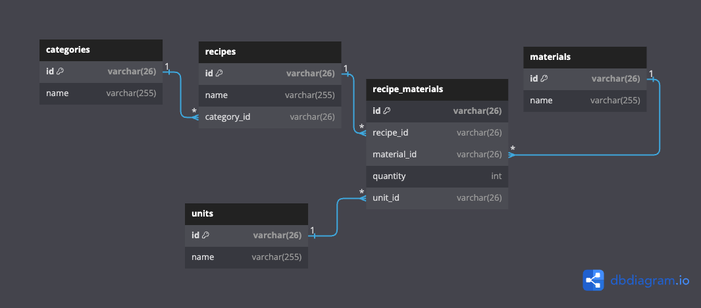

# Recipes API
TLab technical test

## How to run
Make sure [docker](https://docs.docker.com/engine/install/) (and `docker compose`) already installed.

Then just use this command
```shell
docker compose up -d
```
Or can run it on local, just create `.env` file based on `.env.docker`, change the .env config with the correct credentials, then build, and run
```shell
source .env
RUN go mod download
RUN go vet . 
RUN go build -o recipe_api .
./recipe_api
```

## PostgreSQL DB CLI
Open psql while it's already running by docker compose
```shell
docker exec -it recipes_db psql -d recipes_api -U recipe
```
Restore dummy recipes data
```shell
docker exec -i recipes_db psql -d recipes_api -U recipe < dummy_recipes.sql
```

## ERD
[](https://dbdiagram.io/d/64d99e9f02bd1c4a5eb77f1e)